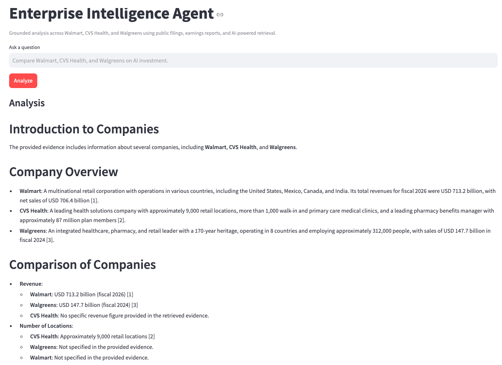

# Enterprise Intelligence Agent

A multi-source RAG application built on Databricks that ingests public enterprise filings, performs hybrid semantic retrieval across governed data, dynamically assembles grounded context, and uses foundation-model inference to produce source-backed analysis.

The current implementation analyzes public filings and earnings materials for Walmart, CVS Health, and Walgreens.

---

## Demo



---

## What it does

The application lets a user ask natural-language questions such as:

- Compare Walmart, CVS Health, and Walgreens on revenue growth and profitability
- What has Walmart said about AI and automation?
- Which company is showing stronger operating leverage?
- What does management commentary suggest about future investment priorities?

The system retrieves relevant evidence from the underlying filings, injects that evidence into the model context, and generates a grounded response with source attribution.

---

## Architecture

```mermaid
flowchart TD
    A[Public Filings & Earnings Reports] --> B[Databricks Volume]
    B --> C[Delta Document Table]
    C --> D[Chunking + Metadata]
    D --> E[Delta Chunk Table]
    E --> F[Hybrid AI Search Index]
    F --> G[Metadata-Aware Retrieval]
    G --> H[RAG Context Assembly]
    H --> I[Databricks Foundation Model]
    I --> J[Streamlit Databricks App]
    J --> K[Grounded Analysis + Sources]

Stack
- Databricks Free Edition
- Delta Lake
- Databricks AI Search
- Hybrid semantic + keyword retrieval
- Databricks Foundation Model functions
- Retrieval-Augmented Generation
- Streamlit
- Databricks SDK
- Python
- SQL
- GitHub

Data model
Raw PDFs are stored in a Databricks Volume and parsed into structured Delta tables.
Document table
company
document_type
source
page
text
Chunk table
chunk_id
company
document_type
source
page
text

Documents are split into overlapping chunks to improve retrieval precision while preserving the full source corpus.
Retrieval strategy
The application uses a hybrid AI Search index over the chunk table.

Hybrid retrieval combines:
- semantic similarity through embeddings
- keyword matching
- metadata associated with each chunk

The first version used a simple global top-K retrieval strategy.
During testing, that created an important failure mode: multi-company questions could over-represent whichever company had the strongest semantic matches.

For example, a comparison question about AI investment returned mostly Walmart evidence because Walmart's filings used stronger and more explicit AI terminology.
The retrieval strategy was then improved to:
- retrieve evidence separately by company when needed
- preserve company and document metadata
- prioritize financial source types for financial questions
- fall back to broader retrieval when primary financial documents do not contain sufficient evidence
This substantially improved multi-entity comparison quality.

RAG flow
The application follows a standard Retrieval-Augmented Generation pattern:

User question
↓
AI Search retrieves relevant chunks
↓
Retrieved evidence is assembled into model context
↓
Foundation model receives:
- user question
- retrieved evidence
- grounding instructions
↓
Model generates a response
↓
Application displays:
- analysis
- source documents
- page references

The model is explicitly instructed to use only retrieved evidence and to state when the available evidence is insufficient.
Example Question:
Compare Walmart, CVS Health, and Walgreens on revenue growth, profitability, and their latest reported financial outlook.

The application:
1. retrieves relevant financial evidence
2. separates evidence by company
3. prioritizes annual reports, 10-Ks, 10-Qs, and earnings releases
4. assembles the retrieved context
5. generates a grounded comparison
6. displays the source documents used

Why I built this
I built this project to deepen my hands-on understanding of modern enterprise data and AI architecture beyond the commercial abstraction layer.
The goal was not simply to create a chatbot.
The project was designed to explore the full path from raw enterprise data to a governed AI-powered application:

Raw data
→ storage
→ transformation
→ chunking
→ indexing
→ retrieval
→ context assembly
→ model inference
→ application
The most valuable part of the build was understanding where RAG systems fail in practice and how retrieval strategy changes the quality of the final answer.

Key lessons
Retrieval quality matters as much as generation quality
A strong model cannot compensate for weak retrieval.
If the relevant evidence is not returned, the model cannot produce a grounded answer.
The model does not automatically know enterprise data
Data existing inside the same Databricks environment does not make it visible to the model.
Relevant context must be explicitly retrieved and passed into the model prompt.
Multi-entity analysis requires retrieval design
Naive top-K retrieval can disproportionately represent one entity.
Query decomposition, metadata filtering, or agentic retrieval can improve balance.
Governance and source attribution matter
Enterprise AI systems need more than good answers.
They also need:
- explicit knowledge sources
- controlled access
- traceable evidence
- source attribution
- predictable behavior when evidence is missing

Repository structure
enterprise-intelligence-agent/
│
├── app.py
├── app.yaml
├── requirements.txt
├── README.md
│
└── docs/
    └── demo-screenshot.png

Current limitations
This is a portfolio / prototype implementation, not a production system.

Current limitations include:
- manually ingested public documents
- limited set of companies
- limited evaluation framework
- no automated SEC ingestion pipeline
- no persistent conversation memory
- no automated citation-link generation
- no production SLA or scaling configuration
- limited Free Edition compute and AI Search capacity

Next steps
Planned extensions include:
- automated SEC filing ingestion
- earnings-calendar driven workflows
- structured financial metric extraction
- additional public companies
- agentic query decomposition
- multi-agent research workflows
- evaluation and retrieval-quality scoring
- automated contradiction checking
- persistent conversational context
- model and retrieval observability
- comparison dashboards

Built with
Databricks, Delta Lake, AI Search, RAG, Streamlit, Python, SQL, and GitHub.
